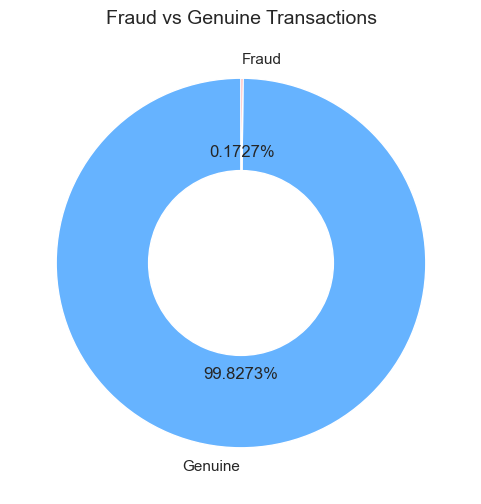
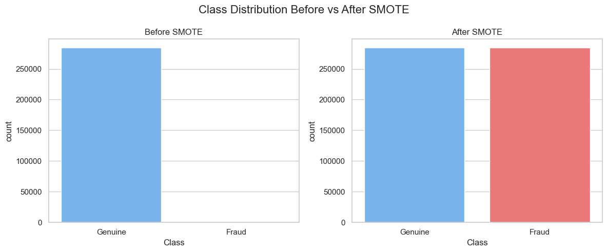
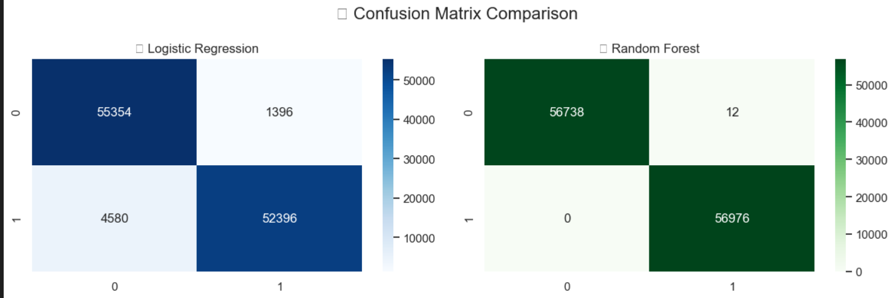
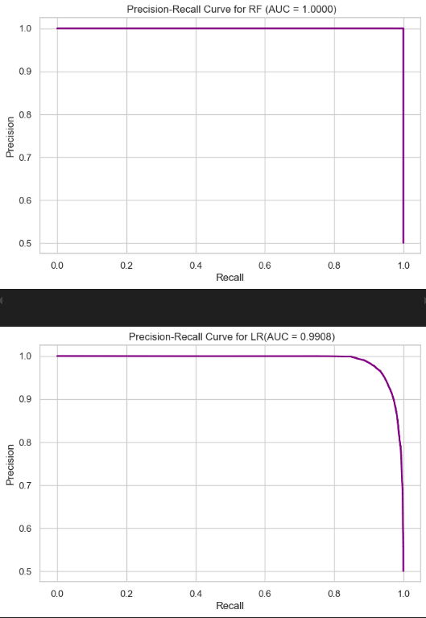
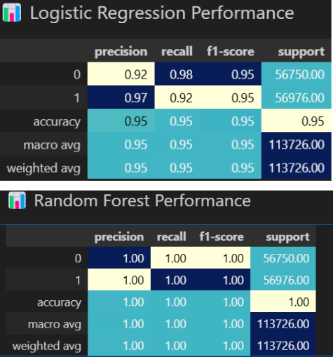

# 💳 Credit Card Fraud Detection – CodSoft Task 2

This project focuses on building a machine learning model to detect fraudulent credit card transactions.  
Due to the extreme class imbalance in the data, techniques like SMOTE and advanced evaluation metrics are used to ensure fairness and accuracy.

---

## 📁 Dataset Information
- *Source*: [Kaggle - Credit Card Fraud Detection](https://www.kaggle.com/datasets/mlg-ulb/creditcardfraud)
- *Total Transactions*: 284,807
- *Fraud Cases*: 492 (only ~0.17% of data)

⚠ *Note*: The file creditcard.csv exceeds GitHub’s 100MB upload limit.  
It is not included in this repo.  
👉 Please download it directly from Kaggle to run the notebook locally:  
🔗 [Click here](https://www.kaggle.com/datasets/mlg-ulb/creditcardfraud)

---

## 💡 Project Workflow
1.  Load & explore dataset
2.  Preprocess: Normalize Amount, drop Time
3.  Rename features (V1 to Feature_1, etc.) for clarity
4.  Handle class imbalance using *SMOTE*
5.  Train & compare models:
   - Logistic Regression
   - Random Forest Classifier
6. 📈 Evaluate with:
   - Confusion Matrix
   - Precision, Recall, F1-score
   - Precision-Recall Curve

---

## 🧪 Model Comparison

| Model              | Precision | Recall | F1-Score           |
|------------------- |-----------|--------|----------          |
| Logistic Regression| Moderate  | High   |  Decent overall    |
| Random Forest      | High      | High   | 🔥Best Performance |

---

## 🖼 Screenshots

|           Visual                       |                Description                  |
|----------------------------------------|---------------------------------------------|
|           | Pie chart & Countplot – Fraud vs Genuine    |
|  | Before/After SMOTE Class Distribution       |
|    | Confusion Matrices                          |
|    | Precision-Recall Curve                      |
|    | Styled_report                               |

---

## 🚀 Technologies Used
- Python
- Jupyter Notebook (VS Code)
- Pandas, NumPy
- Seaborn, Matplotlib
- Scikit-learn
- imbalanced-learn (SMOTE)

---

## ✍ Author

*Kripa Sharma*  
Data Science Intern @ CodSoft

---

## 🔗 Project Repository

👉 [Click here to view on GitHub](https://github.com/kripa-sharma09/CODSOFT/tree/main/Task-2-CreditCard-Fraud)

> ✅ Project submitted as part of Task 2 in CodSoft’s Data Science Internship program.