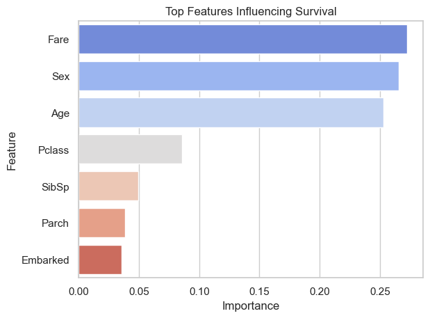

# 🛳 Task 1: Titanic Survival Prediction

This is Task 1 of my Data Science Internship at *CodSoft*.

I developed a machine learning model to predict whether a passenger survived the Titanic disaster using features such as gender, age, class, and fare.

---

## 📌 Key Highlights

- Cleaned and preprocessed the dataset (handled missing values and encoded categorical variables)
- Visualized survival trends by gender, age, and class
- Trained a *Random Forest Classifier*
- Evaluated the model using accuracy and classification metrics
- Analyzed feature importance to see what most influenced survival

---

## 💻 Tech Stack

- Python
- Pandas, NumPy
- Matplotlib, Seaborn
- Scikit-learn

---

## 🔍 Results
- *Model Accuracy*:  0.8044692737430168

- *Top Features*: Fare, Sex, Age, Pclass

---

## 🖼 Visual Examples
Screenshots from the notebook:

### Survival by Gender

### Age Distribution

### Classification Report Output

### Feature Importance

### Survival by Class

### Overall survival

---

## 🎯 How to Run
1. Clone the repository
2. Open Titanic_Prediction.ipynb in Jupyter Notebook or VS Code
3. Run all cells step-by-step

---

## ✨ Internship Credit
This project is part of my **Data Science Internship at [CodSoft](https://www.codsoft.in/)**  
📌 #codsoft #datascience #machinelearning #internship