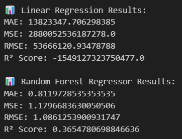

# 🎬 Movie Rating Prediction Project  
### ✅ Data Science Internship — CodSoft  

---

## 📋 Overview  

This project aims to predict IMDb movie ratings based on features like *genre, director, actors, duration, and votes*.  
Using regression techniques, we built models that analyze historical data and provide rating predictions for movies.  

---

## 📂 Dataset Used  

- *Source*: [IMDb India Movies Dataset](https://www.kaggle.com/datasets/adrianmcmahon/imdb-india-movies)  
- Total Records: 15,000+  
- Key Features: Genre, Director, Actors, Year, Duration, Votes  

---

## 🛠 Tech Stack  

- *Python*  
- *Pandas*  
- *Scikit-Learn*  
- *Seaborn & Matplotlib*  

---

## 🤖 Models Used  
| Model             | MAE               | MSE               |  RMSE             | R² Score          |
|-------------------|-------------------|--------|----------|-------------------|-------------------|
| Linear Regression |13823347.706298385 |2880052536187278.0 |53666120.93478788  |-1549127323750477.0|
| Random Forest     |0.8119728535353535 |1.1796683630050506 |1.0861253900931747 |0.3654780698846636 |

(You can update with your actual evaluation metrics)  

---

## 🎯 Evaluation Metrics  

- *MAE* (Mean Absolute Error)  
- *RMSE* (Root Mean Squared Error)  
- *R² Score* (Model Accuracy)  

---

## 📸 Sample Visualizations  

  

| Visualization                              | Description                       |
|--------------------------------------------|-----------------------------------|
|         | Comparison of model performances  |
|   | Shows predicted ratings vs actual |
|         | Error analysis of the model       |

---

## 🔗 GitHub Repository  

[https://github.com/kripa-sharma09/CODSOFT](https://github.com/kripa-sharma09/CODSOFT)  

---

## 👩‍💻 About Me  

*Kripa Sharma* — Data Science Enthusiast & CodSoft Intern 💖  

---